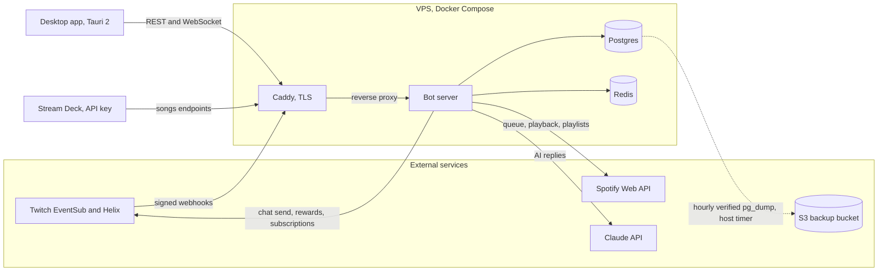

# AlmostHadAI

A multi-tenant Twitch chat bot with a Windows desktop app. One server process
serves many broadcasters, each with their own commands, emotes, quotes, song
queue, AI budget and analytics, and no channel can read or affect another's.

TypeScript on Node 24, strict ESM. PostgreSQL for persistence via Drizzle, Redis
for caching, Twitch EventSub over webhooks for every live event, and a
JWT-guarded REST plus WebSocket API serving the desktop client.

---

## What it does

- **AI chat.** Responds to mentions, plus `!ai`, `!advice` and `!roast`, via the
  Claude API. Per-role rate limits, bucketed per stream, budgeted per channel.
- **Song requests.** Channel-point redemptions add Spotify tracks to a queue. A
  per-channel poller feeds them into Spotify as the current track ends, and
  requested tracks can be saved to the channel's requests playlist.
- **Commands.** Stored per channel. Static text commands are editable from chat
  (`!command add/edit/delete`) and from the app. Richer ones are backed by
  declarative handlers.
- **Emotes.** Exact-match trigger and response pairs, per channel.
- **Quotes.** Added by redemption, recalled by `!quote`.
- **Analytics.** Chat totals, viewing sessions, streams and follows, per channel.
- **Channel points.** Redemptions routed by reward id, with a fulfill-or-refund
  invariant. Anything the bot cannot do gives the viewer their points back.
- **API v1.** REST and realtime for the desktop client, plus API keys for a
  Stream Deck.

### What happens to a channel's data

A streamer's history is the product. Two operations look like they might destroy
it, and neither does.

- **Disconnecting a channel** (the app's danger zone) stops the bot, switches its
  three managed channel-point rewards off at Twitch, and leaves everything else
  alone. The rewards keep their title, cost, prompt and redemption history. They
  are disabled, never deleted, because rewards can predate this application and
  were never its to destroy. Commands, emotes, quotes, chat totals, streams and
  viewers all stay exactly where they are.
- **Reinstalling the app** changes nothing at all. The app is a remote control.
  Every row lives on the server, keyed to the Twitch channel. A streamer who
  uninstalls, reinstalls, and signs back in is looking at the same data.

**Reconnecting a channel restores what was there**, because it was never removed.
The channel row is matched on its Twitch broadcaster id, so re-onboarding rebinds
to the existing history rather than starting a new one. A streamer who leaves for
three years and comes back finds their quotes, commands and lifetime chat totals
intact.

The one thing reconnecting does not do by itself is re-enable the three rewards a
disconnect switched off. Song requests come back when the streamer turns them on
(which flips the reward at Twitch). The skip and quote rewards currently need
turning back on in Twitch's own dashboard. That is a known, deliberate gap.
Re-enabling rewards in someone's channel unprompted is the kind of surprise the
reward handling is otherwise careful to avoid, and the planned fix is recorded in
[`docs/DECISIONS.md`](docs/DECISIONS.md).

Deliberate deletion is a different matter. Rows removed from the database are
gone from the database, and what protects them then is the backup tiering below.

## Architecture



## Repository layout

An npm workspaces monorepo. There is exactly one bot in this repo.

```
shared/     Types and zod schemas, the typed contract between server and client
server/     The bot: transport, session, domain, db, http
app/        The desktop client: Tauri 2 shell, React UI
scripts/    Deploy, backups, secrets, throwaway test database, dump import
caddy/      TLS reverse proxy config
docs/       Decisions register, platform facts, dependency policy, UI catalog
```

Inside `server/src`:

```
transport/  EventSub webhook, signature verification, normalization, reconciler
session/    Per-channel session, chat pipeline, redemption pipeline
domain/     Commands, emotes, quotes, songs, streams, presence, stats, AI toggles
db/         Drizzle schema, channel-scoped repositories, migrations
http/       API v1, auth routes, realtime
spotify/    Client, OAuth, playback monitor
ai/         Claude client, prompt builder, rate limiter, usage counter
```

## Running it

```bash
npm install
npm run dev          # the server, with live reload, in Docker
```

Node 24 or newer (see `.nvmrc`). The full local stack (Postgres, Redis, Caddy and
the server) comes up with Docker Compose. See the development loop below.

### Multi-tenancy in one paragraph

Every repository is bound to a channel id at construction, so a query for one
channel's data cannot be written to return another's. Sessions are shared-nothing.
No static state, no module-level caches, no cross-channel lookups. Redis keys are
namespaced `ch:{channelId}:...`. And no API route accepts a channel identifier.
The credential is the tenant selector, so a token for channel A structurally
cannot address channel B.

## Configuration

### Environment

Validated at boot by `server/src/config/env.ts`, which reports every problem at
once and exits 78.

| Variable | Required | Notes |
|---|---|---|
| `DATABASE_URL` | yes | Postgres connection string |
| `REDIS_URL` | yes | Redis connection string |
| `DATABASE_POOL_MAX` | no | Pool size, default 10 |
| `PORT`, `LOG_LEVEL`, `NODE_ENV` | no | Default 3000 / `info` / `development` |
| `PUBLIC_URL` | for webhooks | The public origin, which must be https in production |
| `TWITCH_EVENTSUB_SECRET` | in production | Webhook signing secret, 10 to 100 ASCII characters |
| `EVENTSUB_MAX_SKEW_SECONDS` | no | Replay window, default 600 (Twitch's documented 10 minutes) |
| `BOT_TWITCH_USER_ID` | no | Overrides `bot_identity` before onboarding exists |
| `AI_TRIGGERS` | no | Comma-separated names the AI answers to, defaulting to the bot's login |

`TWITCH_EVENTSUB_SECRET` defaults to a placeholder so `docker compose up` needs no
configuration, and the server refuses to start on that placeholder when
`NODE_ENV=production`. The placeholder is committed and therefore public, so
shipping it would let anyone forge a signed event. Production compose runs need a
real one:

```bash
TWITCH_EVENTSUB_SECRET=... docker compose -f docker-compose.yml up -d
```

See [`.env.example`](.env.example) for the full annotated list, including the
Twitch application credentials, `TOKEN_ENCRYPTION_KEY` and `JWT_SECRET`.

### Connecting to Twitch

Two consents, and they are different things.

**The bot account, once, globally.** `/auth/bot/connect` records the shared bot
identity and its grant. Only the refresh token is kept, and only so consent can be
re-established. It is on no request path.

**Each broadcaster, per channel.** `/auth/twitch/connect` onboards a channel.
Identity comes from Twitch's validate endpoint (never a supplied login), tokens
are encrypted at rest, the session starts, subscriptions reconcile, and
channel-point rewards are adopted.

**Spotify, per channel.** `/auth/spotify/connect` connects the broadcaster's
Spotify. Unauthenticated visitors are sent through Twitch sign-in first and land
back at Spotify automatically.

### Tokens at rest

AES-256-GCM with a random IV per operation, authenticated with additional data
bound to the column's purpose, so a ciphertext moved between columns fails to
decrypt rather than silently succeeding. The key comes from `TOKEN_ENCRYPTION_KEY`.
In production the server refuses to boot without one.

### How a chat message flows

EventSub delivers a signed webhook. The signature is verified over
`id + timestamp + raw body`. The event is enqueued and acknowledged inside
Twitch's timeout. The session for that broadcaster deduplicates it, records roles
and totals, then runs the pipeline: command, emote, AI trigger, or nothing.

### How a command resolves

`CommandManager` looks the name up in its per-channel cache, then Postgres. A
command either names a `handler_name`, dispatched to a declarative handler that
carries its own permission level, or has static `response_text`. Permission is
decided in exactly one place: the handler's declared level if it has one,
otherwise the database row, and a disagreeing row is corrected at load.

## The desktop app

`app/` is a Windows desktop client, a Tauri 2 shell around a React UI. It talks
to the production server over the same API v1 and realtime feed documented below,
signs in through the system browser (the app is never an OAuth client and holds
no Twitch tokens), and receives its session over a private URI scheme. CI builds
an unsigned NSIS installer as an artifact on tag pushes and on manual dispatch,
verified during the build to point at the production host. The auto-updater is
scaffolded but not yet active. Finishing steps live in `app/README.md`.

## Testing

```bash
npm test               # both suites: server and app
npm run test:server    # the server suite alone
npm run test:app       # the app suite alone
```

The database-backed server suites need a throwaway Postgres:

```bash
eval "$(bash scripts/test-db.sh start)" && REQUIRE_DB_TESTS=1 npm run test:server
```

`scripts/test-db.sh` starts one on port 55432, isolated from the dev database,
which the test helper refuses to touch.

**Skips are loud.** Without `TEST_DATABASE_URL` the DB-backed suites self-skip so
a contributor without Docker can still run the suite, and a banner reports exactly
how many tests did not run. CI sets `REQUIRE_DB_TESTS=1`, which turns any skip
into a failed job. A green check that silently covered nothing is worse than a
red one.

### Local development loop

The server runs in Docker with a live-reload overlay:

```bash
docker compose up
```

`compose.override.yml` is picked up automatically. It bind-mounts `server/src`
and `shared/src` and runs the server through `tsx watch`, so saving a file
restarts the process without a rebuild. Postgres, Redis and Caddy come up
alongside it. The server is on `http://localhost:3000` and through Caddy on
`http://localhost:8080`.

Production and CI use the base file explicitly and never see the overlay:

```bash
docker compose -f docker-compose.yml up --build
```

Working on the server without Docker:

```bash
npm run build          # shared/ must be built once for server/ to resolve it
npm run dev            # tsx watch against a locally-running Postgres/Redis
npm run test:server    # Vitest
```

Schema and repository tests need a Postgres. They self-skip without
`TEST_DATABASE_URL` and CI always supplies one. They wait for a warming database
rather than failing on a cold stack, so `docker compose up && npm run test:server`
works without a pause in between.

The app runs with `npm run dev -w @almosthadai/app` for the browser UI, or
through the Tauri shell with `npm run tauri -w @almosthadai/app -- dev`.

### Feeding the bot events locally

Twitch delivers events by POSTing to a public HTTPS callback, which a laptop does
not have. Rather than run a second transport for development, the same webhook
endpoint is driven with correctly-signed synthetic deliveries:

```bash
npm run dev:event -w server -- --kind chat --broadcaster 1001 --text "!discord"
```

The response appears in the server log as a `CHAT SEND` line, but only for a
channel the server is running, since it bootstraps from `channels` at boot. Two
channels with deliberately colliding command names:

```bash
docker compose exec -T postgres psql -U almosthadai -d almosthadai <<'SQL'
insert into channels (twitch_broadcaster_id, twitch_login) values ('1001','alpha'), ('2002','beta')
  on conflict (twitch_broadcaster_id) do nothing;
insert into commands (channel_id, name, response_text, user_level)
select id, '!discord', 'ALPHA discord link', 'everyone' from channels where twitch_broadcaster_id='1001'
union all select id, '!discord', 'BETA discord link', 'everyone' from channels where twitch_broadcaster_id='2002'
union all select id, '!mods', 'beta mods only', 'mod' from channels where twitch_broadcaster_id='2002';
SQL
docker compose restart server
```

Then `--broadcaster 1001` and `--broadcaster 2002` with the same `!discord`
produce different responses, and `!mods` in beta is refused without `--mod`.

Other kinds:

```bash
npm run dev:event -w server -- --kind online  --broadcaster 1001
npm run dev:event -w server -- --kind verify  --broadcaster 1001
npm run dev:event -w server -- --kind revoke  --broadcaster 1001
```

Flags: `--url` (default `http://localhost:3000/eventsub/webhook`), `--secret`
(default `$TWITCH_EVENTSUB_SECRET`, falling back to the development placeholder),
`--chatter`, `--mod`.

This signs with the same function the webhook verifies with, so it exercises the
real HMAC path. A broken signature scheme fails here exactly as it would against
Twitch.

#### The Twitch CLI

The [Twitch CLI](https://dev.twitch.tv/docs/cli/event-command) can forward signed
mock events to a local address, and it is worth having:

```bash
twitch event trigger streamup -F http://localhost:3000/eventsub/webhook -s dev-only-eventsub-secret-change-me
twitch event verify-subscription streamup -F http://localhost:3000/eventsub/webhook -s dev-only-eventsub-secret-change-me
```

It covers `stream.online` (`streamup`), `stream.offline` (`streamdown`),
redemptions, and the challenge-response check, and `-r revoked` produces a
revocation delivery.

**It cannot trigger `channel.chat.message`**, which is the event nearly every
feature depends on, so it complements the script above rather than replacing it.
Either way there is only one ingest implementation. Both paths POST to the same
endpoint through the same signature check.

### CI

Every push and pull request to `main` runs through GitHub Actions
(`.github/workflows/ci.yml`), on the Node version in `.nvmrc`:

- lint and typecheck
- the server suite with `REQUIRE_DB_TESTS=1` against a service Postgres
- the app suite plus a front-end bundle build
- a Docker image smoke test that boots the real composition root and drives a
  signed synthetic delivery through it
- `npm audit --audit-level=high` in a separate job

A tag push (or manual dispatch) additionally builds the Windows installer on a
Windows runner and verifies the bundle points at the production host before
uploading the artifact.

Dependencies are pinned exactly and updated by Renovate. See
[`docs/DEPENDENCIES.md`](docs/DEPENDENCIES.md).

Lint locally with:

```bash
npm run lint
```

## API v1

JWT-guarded REST plus a channel-scoped realtime feed. The typed contract,
request schemas and response types, lives in `@almosthadai/shared`, so the
desktop client and the server are compiled against the same definitions.

### The tenant rule

**No endpoint accepts a channel identifier.** The credential selects the tenant.
A token issued for channel A resolves to channel A and there is no field,
header, or path segment that can say otherwise. Isolation is a property of the
routing table rather than of every handler remembering a `WHERE` clause.

### Authentication

| Mode | Header | Reaches |
|---|---|---|
| Session JWT | `Authorization: Bearer <token>` | everything |
| API key | `X-Api-Key: ahai_...` | songs endpoints only |

Sign in at `/auth/app/login`. The access token lasts `JWT_TTL_SECONDS` (15
minutes by default) and is renewed at `/auth/app/refresh`, which rotates the
refresh token on every use.

API keys are for a Stream Deck. They are deliberately narrow. A button needs to
skip a track, and a key that could also rewrite commands or read analytics would
be a far worse thing to have taped inside a profile. A key is shown once at
creation and only its hash is stored. There is no recovery endpoint.

### Endpoints

| Method | Path | Purpose |
|---|---|---|
| GET | `/api/v1/me` | caller, channel, settings. The only route valid with no channel |
| PATCH | `/api/v1/me/settings` | `aiEnabled`, `aiLimits`, `songRequestsEnabled`, playlist fields, `discordWebhookUrl` |
| PATCH | `/api/v1/me/channel` | the header master switch (`enabled`) |
| DELETE | `/api/v1/me/channel` | disconnect the channel, see above |
| GET | `/api/v1/commands` | list (`?limit=&offset=`) |
| POST | `/api/v1/commands` | create |
| PATCH | `/api/v1/commands/:name` | update response and/or level |
| DELETE | `/api/v1/commands/:name` | delete |
| GET | `/api/v1/emotes` | list |
| POST | `/api/v1/emotes` | create |
| DELETE | `/api/v1/emotes/:trigger` | delete |
| GET | `/api/v1/quotes` | list, newest first |
| GET | `/api/v1/quotes/random` | one at random |
| GET | `/api/v1/quotes/:number` | by number |
| POST | `/api/v1/quotes` | add |
| DELETE | `/api/v1/quotes/:number` | delete |
| GET | `/api/v1/songs` | queue (key ok) |
| DELETE | `/api/v1/songs/head` | drop the next waiting request (key ok) |
| POST | `/api/v1/songs/skip` | skip what is playing in Spotify (key ok) |
| GET | `/api/v1/songs/playing` | the current track (key ok) |
| POST | `/api/v1/songs/toggle` | enable or disable requests (key ok) |
| GET | `/api/v1/analytics/summary` | totals and top chatters (`?range=`) |
| GET | `/api/v1/spotify` | link status, account, requests playlist |
| DELETE | `/api/v1/spotify` | unlink Spotify |
| GET | `/api/v1/rewards` | the three bot-managed rewards |
| GET | `/api/v1/dashboard` | the dashboard summary |
| GET | `/api/v1/api-keys` | list keys (never the key itself) |
| POST | `/api/v1/api-keys` | create, returns the key once |
| DELETE | `/api/v1/api-keys/:id` | revoke |

Every response uses the standard envelope: `{ok: true, data}` or
`{ok: false, error: {code, message}}`. Codes are `bad_request`, `unauthorized`,
`forbidden`, `not_found`, `conflict`, `rate_limited`, `internal`, `unavailable`.

Quote numbers are never reissued after a delete. A quote is referred to by
number in chat and in clips, so renumbering would silently change what an old
reference points at.

### Realtime

```
wss://<host>/api/v1/live?access_token=<jwt>
```

Authentication happens at the upgrade, before the socket exists, and binds it to
one channel. There is no subscribe message and no way to ask for a different
channel.

| Event | When |
|---|---|
| `hello` | on connect, so a client can render immediately |
| `chat.message` | every chat message, with the pipeline's `outcome` |
| `song_queue.updated` | queue changed |
| `channel.status` | live or offline, and session state |

The server pings every 30 s and reaps a socket that has not ponged by the next
sweep. Browsers cannot set headers on a WebSocket handshake, so the token
travels as a query parameter. That is acceptable because these are our own
short-lived tokens, never Twitch's.

### Rate limiting

Per authenticated principal (user or API key), sliding window, `API_RATE_MAX`
requests per `API_RATE_WINDOW_MS`, 300 per minute by default. Responses carry
`RateLimit-Limit` and `RateLimit-Remaining`. A 429 carries `Retry-After`.

Keyed on the credential rather than the IP address, because behind Caddy every
request shares one source address. An IP-keyed limiter would either throttle the
whole tenancy at once or trust a header the client controls.

## Backups

`scripts/pg-backup.sh`, on an hourly systemd timer, dumps, verifies, then
uploads to S3. Nothing is uploaded and nothing is rotated unless the dump
verifies. It must clear a size floor, parse as a `pg_restore` archive, and
contain tables. An unverified dump is worse than no dump, because it looks like
safety.

Retention is tiered:

| Tier | Kept | Answers |
|---|---|---|
| hourly | newest `MAX_BACKUPS` (default 10) | "undo the last hour" |
| daily | newest `DAILY_KEEP` (default 90) | "the numbers looked wrong on Tuesday" |
| monthly | never rotated | "what did this channel look like last year" |

Hourly backups cannot answer a question nobody asks within a day, and for a
product whose value is multi-year history the later questions are the ones that
actually get asked. That is why the deeper tiers exist.

The daily and monthly copies are promoted, not re-dumped. The same verified
artifact is copied server-side into `daily/` and `monthly/`, so no tier can hold
a dump that was not verified, and the extra tiers cost one S3 copy rather than
another `pg_dump` against a live database. Promotion is idempotent. The first run
of a day claims it and later runs find it already there, which matters because
the timer is `Persistent=true` and a box that was off catches up.

Restores are drilled in CI: see `.github/workflows/restore-drill.yml`.

## Documentation

- [`docs/DECISIONS.md`](docs/DECISIONS.md) is the decisions register: owner
  decisions of record, tracked future work, and standing rules
- [`docs/TWITCH_PLATFORM_FACTS.md`](docs/TWITCH_PLATFORM_FACTS.md) holds sourced
  EventSub and auth facts the transport is built on
- [`docs/DEPENDENCIES.md`](docs/DEPENDENCIES.md) covers pinning policy and the
  update flow
- [`docs/APP_COVERAGE_LEDGER.md`](docs/APP_COVERAGE_LEDGER.md) maps the desktop
  app's surface to the functionality catalog
- [`docs/UI_FUNCTIONALITY.md`](docs/UI_FUNCTIONALITY.md) is the catalog of
  everything the app surfaces

## Status

**In production, serving live channels.** The desktop app is feature-complete
and talks to the production server. What remains before v1 is listed in
[`docs/DECISIONS.md`](docs/DECISIONS.md): the release-process proof, the rebrand,
the security audit, a second channel's onboarding, and the deferred-observations
pass.
