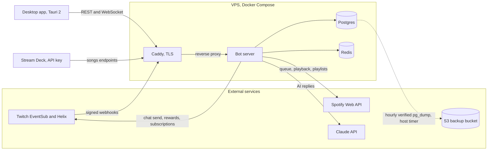

# Cleanup plan

## EXECUTION PROGRESS (updated 2026-08-18 by the first execution session; resume here)

Tasks 1 through 4 are COMPLETE and committed, each at its exact target: docs retired and DECISIONS.md created (task 1), README rewritten with the diagram plus env example completed and the backup header fixed (task 2), server suite at exactly 877 (task 3), app suite at exactly 353 (task 4). One plan/tree conflict recorded for the final report: four of task 2's "nine missing" env variables (PUBLIC_URL, BOT_TWITCH_USER_ID, AI_TRIGGERS, MIGRATION_DATABASE_URL) were already present in .env.example; the five genuinely missing ones were added, and MIGRATION_DATABASE_URL was moved out of the wrongly-labeled compose-only section.

Task 5 is PARTIAL. Done, verified green, and clean of all sweep patterns:

- The British-to-US spelling pass across all 92 flagged files, word-diff reviewed line by line. Includes both planned identifier renames (canceled variable, list-row__behavior class) plus these additional internal renames, all typechecked: DumpViewer, DumpTokenSource, dumpStreamToUuid, dumpStreamId, toleratePlaintext.
- import-legacy.ts renamed to import-dump.ts; scripts/etl-import.sh updated including the throwaway MySQL database name (now "recovered").
- Fully swept files (em dashes, glyphs, phase markers, legacy wording, narrative comments): all of server/scripts/etl/, server/src/http/api/resources.ts, server/src/db/schema/content.ts, server/src/spotify/spotifyClient.ts, README.md, .env.example (the touched lines), docs/DECISIONS.md (born clean).

NOT yet swept (the sweep patterns to grep for are in the exit-criteria table): the rest of server/src (roughly 190 em dashes plus phase markers and legacy prose across ~45 files; worst remaining: bootstrap.ts, subscriptionReconciler.ts, thirdPartyHandlers.ts, analyticsRepository.ts, channels.ts schema, index.ts, statsHandlers.ts, songRedemption.ts, aiService.ts, playbackMonitor.ts, and the test files), all of shared/src, all of app/src (~130), scripts/*.sh and CI yml comment text, eslint.config.js (historical header comment), and the four surviving docs (TWITCH_PLATFORM_FACTS ~59, UI_FUNCTIONALITY ~33 plus its stale feature markers and audience framing, APP_COVERAGE_LEDGER ~19, DEPENDENCIES ~15 plus its two stale claims). Tasks 6 (owner-gated chat strings; the inventory was presented to the owner, approvals may already be in the conversation), 7 (deploy) and 8 (delete this file, measure exit criteria) remain.

Task 6 is COMPLETE, applied out of order because the approvals arrived while this session was live: the owner explicitly approved ALL FIVE chat-string changes, item by item, and all five are applied and committed (ellipsis to three periods with the length arithmetic and its test updated, both quote colons dropped, both song-reply em dashes to hyphens, "The music service" now "Spotify"). Exemption 6 in the list above is therefore empty: no chat string was declined, so no chat-string characters join the exemption list. The final report should record: approved 1, 2, 3, 4, 5; declined none.

Method notes for the resuming session: rewrite em-dash sentences by hand (comma, period, parentheses), never sed; spelling-style word swaps may be scripted but the diff must be read; test names count as text; keep every gate green and commit at green points; the exemption list at the top of this file is byte-sacred. Remaining after task 5 completes: task 7 (deploy, which now also ships these approved chat strings), then task 8.

This document is the full instruction set for the close-out cleanup cycle. It was produced by a review session that audited every test, every doc, and the full readable-text surface of the repo. The execution session works through it top to bottom. Deleting this file is the executor's final act (task 8), so the final glyph counts are measured after it is gone.

Ground rules, restated from the owner:

- Server tests run only against the throwaway database. Start it with `eval "$(bash scripts/test-db.sh start)"` and run `REQUIRE_DB_TESTS=1 npm run test:server`. Never point tests at the dev compose database.
- "Typecheck clean" means `npm run typecheck` at the repo root exits 0. Lint clean means `npm run lint` (eslint over the repo) exits 0.
- Every commit point must be green on all four gates (typecheck, lint, server suite, app suite).
- No server behavior changes except the wording of log strings. Bot chat strings change only with the owner's explicit per-string approval (task 6).
- Commit messages in plain English describing the change, no package identifiers, each ending with the trailer `Co-Authored-By: Claude Fable 5 <noreply@anthropic.com>`. The owner pushes.
- The sweep must never make text less true. A comment carrying a load-bearing warning gets rewritten plainly, never deleted.

## Mechanical exit criteria

Run these after task 8 (this file deleted). Expected values in the right column. The exemption list follows the table.

| Check | Command | Expected |
|---|---|---|
| Em dashes | `git grep -I -P -o "\x{2014}" -- . ':!package-lock.json' \| wc -l` | 0 outside exemptions |
| All non-ASCII | `git grep -I -P -n "[^\x00-\x7F]" -- . ':!package-lock.json'` | only the exempt lines below |
| British spellings | `git grep -I -P -i -o "behaviour\|colour\|honour\|recognis(e\|ed\|ing\|ation)\|normalis[a-z]*\|initialis[a-z]*\|organis(e\|ed\|ing\|ation)\|fulfil(?!l)\|favourite\|licence\|artefact\|analyse\b\|analysed\|analysing\|optimis(e\|ed\|ing\|ation)\|minimis(e\|ed\|ing)\|customis[a-z]*\|serialis[a-z]*\|authoris(e\|ed\|ing\|ation)\|capitalis(e\|ed)\|utilis(e\|ed\|ing)\|summaris[a-z]*\|flavour\|whilst\|cancell(ed\|ing)\b\|travell(ed\|ing)\b\|practis(e\|ed\|ing)\b\|defence\|offence\|apologis[a-z]*" -- . ':!package-lock.json' \| wc -l` | 0 |
| Phase and package markers | `git grep -I -nE "Phase[ -]?[01]\|P[01]-WP\|WP-?[0-9]" -- . ':!package-lock.json' \| wc -l` | 0 |
| The word legacy | `git grep -I -in "legacy" -- . ':!package-lock.json'` | only eslint.config.js, and only if that use is ESLint's own official term for its config format |
| Deleted docs | `ls docs/` | DECISIONS.md, TWITCH_PLATFORM_FACTS.md, DEPENDENCIES.md, APP_COVERAGE_LEDGER.md, UI_FUNCTIONALITY.md and nothing else |
| Old doc name | `git grep -c "PHASE1_EVENTSUB_FACTS"` | 0 matches |
| Server tests | `eval "$(bash scripts/test-db.sh start)" && REQUIRE_DB_TESTS=1 npm run test:server` | green, 877 tests |
| App tests | `npm run test:app` | green, 353 tests |
| Typecheck | `npm run typecheck` | exit 0 |
| Lint | `npm run lint` | exit 0 |

Baselines measured by the review session, for comparison: 2,763 non-ASCII characters in tracked text (1,705 em dashes), of which 1,059 survive the doc deletions (844 em dashes). 206 British spellings. 227 Phase or package markers outside docs plus many more inside. 51 uses of "legacy" outside docs. Server suite 936 runtime tests, app suite 369.

Exemptions (functional characters, not prose; do not change):

1. `server/src/domain/quoteRedemption.ts` line 22. The `QUOTE_PATTERN` regex deliberately accepts curly quotes and en or em dashes because phone keyboards produce them. The regex literal keeps its non-ASCII alternates.
2. `server/src/session/redemption.test.ts` parser fixtures (the parseQuote table, currently near lines 56 to 59). Fixture strings containing curly quotes and dashes are the inputs under test. Prose comments elsewhere in the same file still get swept.
3. `server/src/crypto/tokenCrypto.test.ts` line 127, the string `'emoji 🎮 token'`, a round-trip encryption fixture.
4. `app/src/content/validation.test.ts` line 52, the fixture `'!ÉMOJI'`, testing non-ASCII lowercasing.
5. `server/src/config/env.test.ts` line 277, the fixture `'sécret-with-accents'`, testing the ASCII-only secret rule.
6. Any chat-visible string the owner declines to change in task 6 keeps its current characters. List the declined sites in the final report.

The final non-ASCII grep must list only lines belonging to these exemptions.

## Task 1: rescue forward-looking content, then retire the process docs

Do the rescue and the deletions in one commit so no forward-looking content is ever absent from the tree.

### 1a. Create docs/DECISIONS.md

A single living doc describing decisions of record and tracked future work. The source docs still exist when you start, so migrate content by reading the named sections directly. Sweep style on the way in (no em dashes, US spellings, no process narrative, no package identifiers). Required sections and sources:

1. **Locked owner decisions.** The eight decisions in `docs/PHASE1_DESIGN.md` section 8, each rewritten to stand alone. Decision 8 (database hosting) must carry the section 4.1 substance it references, meaning the six guardrails and the Tier 1 graduation triggers and procedure. Also record the requests-playlist elevation from section 3 (the owner declared it core, with the toggle, streamer-named playlist, create-if-missing, skip-gracefully spec that `docs/UI_FUNCTIONALITY.md` section 8 points at).
2. **Tracked future work.** From `docs/PHASE1_DESIGN.md` section 9, full substance, no compression of operational detail. Chat-message retention (trigger is a multi-GB table or query slowdown, aggregates stay permanent). Queue-truth reconciliation (the verify-with-tolerance shape, the unverified Spotify read-queue endpoint, the playback monitor re-read as the seam). Spotify platform lockdown and the bring-your-own-app research (allowlist requirement, the 250k-MAU extended-quota wall, no programmatic app creation, each streamer needs their own Premium in every model). The friend's onboarding as the standing acceptance test.
3. **Deferred observations ledger.** The 8-row table at the tail of `docs/WORK_PACKAGES.md`, all columns, including row 7's provenance-based reward restore spec in full (record which rewards the teardown itself disabled, re-enable exactly those on reconnect, owner-visibly logged; a blanket re-enable would trample the streamer's own choices).
4. **Specced, not built.** Provenance-based reward restore (above). Played-history table (the now-playing requester is memory-only and a restart loses it). Chat-totals batching (the scale path named in the method's own comment). Usage-counter threshold and always-on preference as `channel_settings` fields for the AI settings screen.
5. **Open register.** From the tail of `docs/WORK_PACKAGES.md`: declined-scope naming, viewer-detail endpoints, bug-report affordance, `ChannelSummary.connectedAt`, updater verdict for the settings screen (updater scaffolded inactive, finishing steps in `app/README.md`), `findPlaylistByName` bounded at 10 pages, commands and emotes fetched at limit 200 and paged in memory, tokens in localStorage behind the SessionStorage seam (a security-audit input).
6. **Ops backlog.** Production-artifact restore drill, registry-based deploy, duplicate-rate counters, optional external uptime monitor, S3-sourced restore-drill upgrade, Node-20 GitHub-Action runtime bumps, the standing moderate npm advisories.
7. **Security-audit stage.** The full spec from the FUTURE section of `docs/WORK_PACKAGES.md`: a separate fresh session before any public launch, scope covering auth and OAuth flows, the public webhook, API authorization and tenant isolation, secret handling, dependency CVEs, and the public repo itself, with the named audit inputs (localStorage seam, WebSocket token-in-query with the ticket-endpoint upgrade path, webview CSP breadth, OAuth state in-memory fallback).
8. **Definition of v1 and what remains.** v1 is everything through the security audit plus owner-added features to be specified later. Remaining: release-process proof, rebrand, security audit, the friend's onboarding, the deferred-observations pass, owner features.
9. **Rebrand carriers.** README, package.json, Docker image name, the Postgres volume name, the deploy path /opt/almosthadai, the DuckDNS host plus Twitch and Spotify console redirect URIs, the bot's Twitch login (a separate decision), the CI installer's VITE_API_BASE_URL, the app icon, the APP_NAME constant.
10. **Design principles.** The status versus enabled versus disconnected rule from `docs/LEAD_ONBOARDING.md` (status is what the world did to a channel, enabled is what the owner chose, disconnected is a teardown the broadcaster can reach, and conflating them lies to the broadcaster). The product default stance from `docs/UI_FUNCTIONALITY.md` section 12 (offline streamer, quiet bot).
11. **House rules.** Any new env var lands in three places in one commit (env.ts schema, .env.example, compose passthrough; VITE_ vars exempt as client-build-time). Typecheck clean means the root command. Server tests only on the throwaway DB. Reintroduction validation for bug-pinning tests. The contract in shared/src/contract/ wins over any doc. Plain-English commit messages with the standard trailer.
12. **Open items.** The design-review zip in the owner's Downloads folder awaits the owner's confirm-to-delete. The adjacent design-capabilities zip belongs to a different project and must not be touched. The .gitignore rule for the design-handoff directory stays.

### 1b. Delete, rename, verify

- Delete `docs/WORK_PACKAGES.md`, `docs/LEAD_ONBOARDING.md`, `docs/PHASE1_DESIGN.md`, and the whole `docs/archive/` directory. Git history is the archive; say so in the commit message.
- `docs/UI_FUNCTIONALITY.md` is NOT deleted. Verification found the coverage ledger does not supersede it: the ledger's own header says to read it alongside UI_FUNCTIONALITY and every ledger row is keyed to its section numbers. Both survive and get swept in task 5.
- Rename `docs/PHASE1_EVENTSUB_FACTS.md` to `docs/TWITCH_PLATFORM_FACTS.md`. Update every reference (server source comments cite it, some with the section glyph; rewrite those as plain "docs/TWITCH_PLATFORM_FACTS.md section N" while you are in task 4). `git grep PHASE1_EVENTSUB_FACTS` must return nothing when done.
- Check that the ETL's own files state the dump-secrecy rule (never print or log token values from the recovered dump). If absent, add one comment line in `server/scripts/etl/` saying so.

## Task 2: README rewrite and architecture diagram

Full accuracy pass. Every claim below was verified against code by the review session; anything not listed here was checked and found correct (JWT TTL default 900 s, rate limit 300 per 60 s default, WebSocket ping every 30 s via LIVE_HEARTBEAT_MS, exit code 78 on config failure, test-db port 55432, quote numbers never reissued, API keys songs-only, the four realtime events, the endpoint table, EventSub replay window 600 s, secret length 10 to 100 ASCII).

Corrections required:

1. Test counts. "Roughly 770 tests across 45 files" is stale. State the real post-reduction numbers measured after tasks 3 and 4 (expected 877 server, 353 app) or drop precise numbers entirely.
2. Repository layout omits `app/` and `caddy/`. Add both. Update the docs/ line to name the surviving docs.
3. The Status section says the desktop client is next. It shipped. Rewrite: in production serving live channels, desktop app feature-complete, then the remaining-before-v1 list (link DECISIONS.md). Remove the 3,592-line absorption-ledger reference and the WORK_PACKAGES and archive links.
4. The Documentation section must link only surviving docs: DECISIONS.md, TWITCH_PLATFORM_FACTS.md, DEPENDENCIES.md, APP_COVERAGE_LEDGER.md, UI_FUNCTIONALITY.md.
5. `/auth/twitch/bot` does not exist. The route is `/auth/bot/connect`.
6. Backup retention. The code default is `MAX_BACKUPS=10`, not 24. Write "newest MAX_BACKUPS (default 10)" for the hourly tier. Also fix the self-contradiction inside `scripts/pg-backup.sh` (the header comment says 24 where the code says 10). The review session could not verify what value the VPS timer exports; do not assert a production value the repo cannot prove.
7. The README points at `.env.example` as the full annotated list, but nine schema variables are missing from it: AI_COUNTER_THRESHOLD, AI_MODEL, AI_TRIGGERS, ALLOW_LOOPBACK_RETURN_TO, ANTHROPIC_API_KEY, BOT_TWITCH_USER_ID, IMAGE_SEED_SALT, MIGRATION_DATABASE_URL, PUBLIC_URL. Add them to `.env.example` with one-line annotations, which also honors the house env-var rule. POSTGRES_PASSWORD and APP_DB_PASSWORD are compose-level and correctly absent from the server schema.
8. The Testing section covers only the server. Add the app suite (`npm run test:app`), note `npm test` runs both, and describe CI accurately: lint, typecheck, server tests with REQUIRE_DB_TESTS=1 against a service Postgres, app tests plus a front-end bundle build, a Docker image smoke test that boots the real composition root and drives a signed synthetic delivery, a tag-gated Windows installer job, and npm audit at level high.
9. Add a short desktop-app section: what it is (Tauri 2 + React), that it talks to the production server over the same API v1 and realtime feed, the CI installer artifact, and that the auto-updater is scaffolded but not yet active (finishing steps in app/README.md).
10. Add the architecture diagram below (Mermaid, GitHub renders it). Verify each edge still matches code before committing.
11. The README itself is subject to the task 4 style rules (41 lines currently carry em dashes, plus "normalisation" and "fulfil"). Rewrite as you go.

Diagram source, verified against caddy/Caddyfile, bootstrap wiring, and scripts:

## Task 3: server test reduction (936 to 877)

Fourteen kills and twelve merge groups. Everything not named here stays exactly as it is. Read each verdict against the file before cutting; if any rationale no longer matches the code, keep the test and note it in the final report.

Merge convention: each merge group becomes one `it()` iterating a rows table inside the test body (not `it.each`), so the runtime count for the group is exactly 1. Every assertion row from the merged tests must appear in the table. Where a merged test carried a load-bearing comment (noted below), the comment moves onto its row, rewritten to task 4 style.

Kills (criterion in parentheses):

| File | Test | Why |
|---|---|---|
| transport/eventsub/revocationRecovery.test.ts | "returns immediately, so the webhook is never delayed" | vacuous: a sub-50 ms wall-clock assertion on a synchronous void call cannot catch the async regression it names |
| http/health.test.ts | "needs no authentication" | strictly weaker duplicate of "reports ok with version and uptime" (same route, expects 200) |
| http/authRoutes.test.ts | "still issues tokens for an ordinary sign-in with no continuation" | weaker duplicate of "issues an access token and a refresh token" through the identical callback path |
| http/api/dashboard.test.ts | "counts commands as messages, because they are chat lines" | property already proven inside "counts messages and distinct chatters, not rows per person" |
| auth/jwt.test.ts | "hashes deterministically, so lookup by hash works" | subsumed by "issues a token alongside the hash that gets stored" |
| auth/returnTo.test.ts | "accepts it in production, where loopback is off" | byte-for-byte duplicate of "accepts the desktop client own scheme"; the 12-row attack table is untouched |
| config/env.test.ts | "still rejects an empty REQUIRED variable" | identical input, weaker assertion than "rejects an empty DATABASE_URL with a useful message" |
| domain/commandManager.test.ts | "lets anyone run an everyone command" | covered by the mod/viewer canRun pair plus permissions.test.ts |
| domain/stream.test.ts | "buckets AI rate limits on the stream uuid" | both halves asserted by "resumes the open stream" and "reopens the same stream" |
| domain/gameHandlers.test.ts | "charges the caller when they target themselves" | identical invocation as "targets the caller when no name is given"; fold its requester-equals-target assertion into that survivor |
| ai/usageCounter.test.ts | "defaults to three" | asserts the constant equals itself; the boundary tests pin the behavior |
| ai/ai.test.ts | "takes the BEST applicable tier, not the last one checked" | duplicate of aiLimits.test.ts "gives someone holding several tiers the best of them", which is sharper |
| ai/ai.test.ts | "keeps the game commands free of chat history" | behavior pinned by "uses the game prompt and sends no chat history"; the rest is a constant equaling itself |
| scripts/etl/transform.test.ts | "handles an empty set" | empty array in, empty array out of a pure sort-and-map |

Merge groups:

| File | Group | Members become one table |
|---|---|---|
| session/chatPipeline.test.ts | permission enforcement | "blocks a viewer", "allows a mod", "allows the broadcaster" |
| session/chatPipeline.test.ts | emote matching | "responds to an exact trigger", "is case-insensitive", "does not fire on a partial match" |
| session/redemption.test.ts | parseQuote formats | the six format tests, keeping every input row including the curly-quote and long-dash fixtures (exempt characters) |
| services/helixChatSink.test.ts | swallowed send failures | the three swallow tests, one error-shape table; "reports an accepted-but-dropped message" stays separate |
| config/env.test.ts | invalid env values | the eight single-variable reject tests (missing DATABASE_URL, missing REDIS_URL, PORT 0, PORT 70000, non-integer PORT, unknown NODE_ENV, malformed PUBLIC_URL, short JWT_SECRET, non-ASCII secret rows); every row still expects ConfigError |
| domain/permissions.test.ts | level matrix | the four level-gating tests as one level-by-role table |
| spotify/spotify.test.ts | parseTrackId | the six parser tests, keeping the localized-link row and its comment |
| spotify/spotify.test.ts | refund reasons | the six refund-path tests as an arrange-input-expected table |
| twitch/helixApi.test.ts | rateLimitDelayMs | the five pure-function tests as a headers-to-range table |
| scripts/etl/transform.test.ts | routeTokenKey | the six routing tests; keep the server-secrets-not-imported row's warning comment, rewritten without doc-section naming |
| scripts/etl/transform.test.ts | user_id validity | the three id-validity tests; keep the username-rejection row's warning comment, rewritten without the package identifier |
| scripts/etl/transform.test.ts | resolveRequester | the four lookup tests |

Do not touch (audited and found load-bearing despite appearances): "survives the database being unavailable" (revocationRecovery, its teeth are the unhandled-rejection harness), the dry-run tests (EVENTSUB_DRY_RUN is live config defaulting to true), "recognises its own subscription when Twitch echoes an empty optional field" (pins reconcile churn that shipped), "does not point waifu at the dead arfa.dev path" (only pin on the live host), "uses the renamed playlist items path" (pins the endpoint that 404'd in production), the 2xx-empty-body trio plus "hands a track to Spotify exactly once" (the shipped duplicate-queue incident), "never shows a counter, which is the regression itself", "ports the Phase-0 text unchanged" (pins the roast prompt's safety instruction; rename the test in task 4, keep the assertions), "trusts the validated identity", "does not advertise the framework", the full returnTo attack table, everything in schema.test.ts, isolation suites, contentReload, settingsReload, and the ETL tokens suite (the ETL is alive: scripts/etl-import.sh invokes it, and it was retained by explicit spec as the dump-recovery path).

Decision point recorded for the owner, no action now: if the migration is ever declared final and the dump retired, `server/scripts/etl/` and its remaining 22 tests retire together as a unit.

## Task 4: app test reduction (369 to 353)

Nine kills, three merge groups. Same conventions as task 3.

Kills:

| File | Test | Why |
|---|---|---|
| theme/theme.test.ts | "keeps the product name in exactly one constant" | vacuous length check plus a duplicate of "writes the tokens and the product name onto the document" |
| shell/shell.test.tsx | "renders the switch inert when Twitch has revoked consent" | same-layer duplicate of the unreachable-server inert test; the decision itself is pinned in channelStatus.test.ts |
| live/connection.test.ts | "uses the real WebSocket when no factory is supplied" | despite the name it supplies a factory, so the default path is never exercised |
| dashboard/dashboard.test.tsx | "never says OFFLINE for a server we cannot reach" | same-layer duplicate of channelStatus.test.ts "reports UNKNOWN, never OFFLINE" |
| dashboard/dashboard.test.tsx | "needs_reauth outranks live" | duplicate of channelStatus "reports NEEDS RECONNECT over live" |
| dashboard/dashboard.test.tsx | "makes the switch inert whenever acting on it could not work" | duplicate of the channelStatus isMasterSwitchOperable tests |
| dashboard/dashboard.test.tsx | "counts from the stream start, not from now" | duplicate of channelStatus "formats hours, minutes and seconds" |
| dashboard/dashboard.test.tsx | "pads minutes and seconds so the pill does not jitter in width" | duplicate of channelStatus "pads minutes and seconds but not hours" |
| dashboard/dashboard.test.tsx | "never runs backwards when the clock disagrees with the server" | duplicate of channelStatus "does not go negative when clocks disagree" |

The six dashboard kills resolve a same-layer duplication in channelStatus.test.ts's favor (the dedicated home with the fuller matrix). Cut one side only, never both.

Merge groups:

| File | Group | Members |
|---|---|---|
| shell/shell.test.tsx | pill states | "shows LIVE with the uptime", "shows OFFLINE...", "shows NEEDS RECONNECT...", "shows UNKNOWN..." as one table; the UNKNOWN row keeps its not-OFFLINE negative assertion |
| screens/screens.test.tsx | sign-in reachability pill | the three serverReachable variants (true, false, null) |
| analytics/analytics.test.tsx | young-data footer | the three footer tests (count N, singular 1, absent at threshold) |

Do not touch: App.test.tsx (whole file, auth arc and cross-layer wiring), deepLink and useAuth and sessionStore suites (auth and hostile-input surface), validation.test.ts (whole file, contract mirroring plus absolute-value pins), settings.test.tsx (secret handling and the danger card), "never emits a state that claims anything about the channel" (the tripwire for the app's central two-truths invariant), "has no add button anywhere" (pins a by-design absence and its policy copy), "has no destructive action other than disconnect".

Expected count arithmetic: server 936 minus 14 kills minus 45 merged-away is 877. App 369 minus 9 minus 7 is 353. If your vitest totals differ after the cuts, reconcile before proceeding, do not force the number.

## Task 5: the style sweep

Scope: all readable text in the repo. Comments, docs, log strings, app UI copy, script output, test names, CI comments. Excluded: the chat-visible strings (task 6 owns those), the exempt lines listed at the top, and wire or contract values (never rename a contract field or an enum value; the FULFILLED and CANCELED redemption values are Twitch's own and already US-spelled).

Rules:

1. No em dashes in prose. Rewrite the sentence (comma, period, parentheses). Do not sed; each sentence is rewritten by hand and must keep its meaning.
2. No colons or semicolons inside prose sentences. Label colons before values or lists are fine. Code syntax is obviously exempt.
3. No comments addressed to a person or reviewer.
4. No narrative or historical comments. Nothing referencing prior implementations, removed code, phases, package identifiers, or how a bug was found. A comment may state a current constraint and its current reason, plainly. Example: the usageCounter.ts header currently tells the story of a shipped regression across two phases; it becomes a short statement of the current rule (counter only when 3 or fewer remain, never for caps of 1000 or more, threshold env-tunable). The regression-pinning TESTS keep their assertions, but their names and comments are rewritten in present tense (for example "never shows a counter for an unlimited cap" instead of naming the regression's history).
5. No emojis or non-keyboard glyphs. Arrows become "to" or "->". The ellipsis character becomes three periods. En dashes become hyphens. Multiplication signs, section signs, middle dots, box-drawing characters, check marks, all gone. ASCII-art diagrams in surviving docs are either redrawn in ASCII or replaced with Mermaid.
6. British to US spellings everywhere in text. In identifiers only where internal and provably safe. The audit found exactly these identifier renames, all internal: the `cancelled` local variable in `app/src/auth/useAuth.ts`, and the `list-row__behaviour` CSS class defined in `app/src/theme/global.css` and used in `app/src/content/Commands.tsx`. Everything else is comments, test names, and prose. No contract field carries a British spelling (verified).
7. Verbose or AI-flavored diction tightens to plain engineering prose.
8. The word "legacy" and the phase vocabulary get replaced with plain description. The ETL describes "the recovered dump" or "the previous bot's export". Rename `server/scripts/etl/import-legacy.ts` to `import-dump.ts` and update the reference in `scripts/etl-import.sh`. The eslint config may keep "legacy" only if it is ESLint's own term for the config format there.
9. Log strings may be reworded (this is the one permitted server-behavior change). Example: bootstrap.ts logs "the bot cannot recognise its own messages"; fix the spelling.

Order of work: server/ and shared/ and scripts/ and root configs first, then app/, then the surviving docs (TWITch_PLATFORM_FACTS, DEPENDENCIES, APP_COVERAGE_LEDGER, UI_FUNCTIONALITY). In UI_FUNCTIONALITY also refresh the stale feature markers (nearly every partially-built marker from its freeze date describes something now built per the coverage ledger) and remove the design-handoff audience framing. In DEPENDENCIES fix the two stale claims (the deleted second suite, the advisory-count snapshot). App UI copy is sweepable without approval; where a test asserts copy verbatim, change both together.

Heavy files, for planning: shared/src/contract/resources.ts (29 em-dash lines) and server/src/http/api/resources.ts (24) are the densest source files. The README (41) is handled in task 2. Around 200 source files carry at least one em dash.

## Task 6: the owner-gated chat strings

Present this inventory to the owner verbatim. Apply only what the owner explicitly approves, item by item. Anything not approved stays byte-for-byte identical. The review session verified all chat output flows through the single ChatSink seam and found 69 repo-static chat-visible strings, of which 5 violate a sweep rule.

| # | Site | Current | Proposed | Rule |
|---|---|---|---|---|
| 1 | services/helixChatSink.ts:51, truncation suffix on messages over 500 chars | appends `…` (ellipsis character) | append `...` and slice to MAX_MESSAGE_LENGTH - 3 so the total stays 500 | non-keyboard glyph |
| 2 | domain/quoteRedemption.ts QUOTE_FORMAT_HELP | "Please use the format: \"Your quote here\" - Person who said it. Your points have been refunded." | drop the colon: "Please use the format \"Your quote here\" - Person who said it. ..." | colon in prose |
| 3 | domain/quoteRedemption.ts:79 | "@Name Quote #N added: \"text\" - author" | "@Name Quote #N added - \"text\" - author" | colon in prose |
| 4 | domain/songRedemption.ts:105 | "... is #N in the request list — X songs ahead of it." / "... — it plays when the current song ends." | same text with " — " replaced by " - " in both branches | em dash |
| 5 | domain/songRedemption.ts:55 | "The music service is not connected right now. Your points have been refunded." | "Spotify is not connected right now. Your points have been refunded." | vague diction; every sibling message names Spotify |

Notes for the owner: the counter suffixes "(N left this stream)" and "(last one this stream)" were checked and are clean, no change proposed. String 4's "request list" phrasing was the owner's own choice and is preserved; only the dash changes. Borderline sites judged clean but listed for the owner to overrule if wanted: the "Usage:", "Now playing:", "Last played:", "Up next:", and "Top N Most Active Viewers:" label colons, and the StubAiService "AI is not wired up yet" text that only appears in a build with no AI configured.

If string 1 is approved, adjust the truncation length arithmetic exactly as stated and update the helixChatSink tests that assert the suffix. If it is declined, its ellipsis character joins the exemption list.

## Task 7: deploy

After all sweep commits are in and green, run `scripts/deploy.sh` (it probes readyz on the box) and then check `https://almosthadai.duckdns.org/healthz` from outside. This is the only production action in the cycle. The deploy ships only log-wording changes plus any owner-approved chat strings.

## Task 8: delete this file

`git rm docs/CLEANUP_PLAN.md`, commit, then run every check in the exit-criteria table and put each measured value in the final report, alongside: which chat strings the owner approved and declined, any test verdict you overrode with the reason, and anything you could not verify.

## Verified versus assumed, for honesty

Everything in this plan was verified against the working tree by the review session on 2026-08-17 except: the production value of MAX_BACKUPS on the VPS (repo cannot prove it), the VPS systemd timer contents, and the live behavior of the deployed site. The counter feature (usageCounter.ts) was verified correct end to end including the env knob wiring and needs no code change, only the comment sweep. The test counts 936 and 369 were reproduced exactly by the audit, so the audit covered every test.
